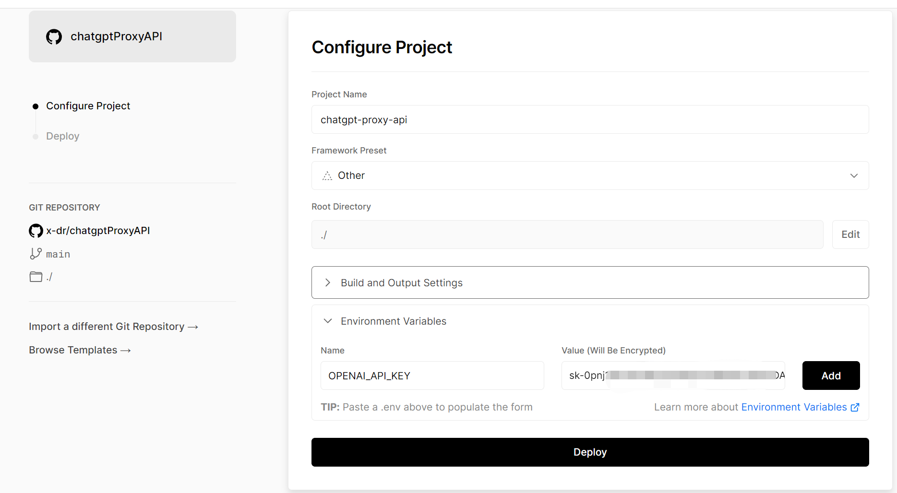

### 部署到Vercel

1. 创建一个[Vercel](https://vercel.com/)帐户
2. [Fork 项目](https://github.com/x-dr/chatgptProxyAPI/fork)
3. 从仪表板页面单击导入项目，然后指定 GitHub 上项目分支的 URL。
4. 将所需的环境变量添加OPENAI_API_KEY 项目中。



5. 点击Deploy部署你的应用程序。


### Docker部署

```shell
docker run -dit \
  -p 3035:3035 \
  -e OPENAI_API_KEY="sk-xxxxxxxxxxxxxx" \
  --name chatgptproxyapi \
  --restart unless-stopped \
  gindex/chatgptproxyapi:latest
```

### 使用
<details>
<summary>使用</summary>

```javaScript
import axios from 'axios';
const headers = {
    "User-Agent": "Mozilla/5.0 (Windows NT 10.0; Win64; x64) AppleWebKit/537.36 (KHTML, like Gecko) Chrome/110.0.0.0 Safari/537.36",
}
const requestPromise = async (params) => {
    return axios({
        url: params.url,
        method: params.method || 'POST',
        headers: params.headers || headers,
        data: params.body,
        validateStatus: status => {
            return status >= 200 && status < 400;
        },
        maxRedirects: 0
    })
        .then(res => {
            return res;
        })
        .catch(err => {
            // console.log(err);
            return err;
        })
}


let res = await requestPromise({
    url: 'https://api.api.api/chatgpt',
    body: {
        "q": 'What is OpenAI?'
    }

});

console.log(res.data.text);

res = await requestPromise({
    url: 'https://api.api.api/chatgpt',
    body: {
        "q": 'Can you expand on that?',
        "opts": {
            "parentMessageId": res.data.id
        }
    }

});

console.log(res.data.text);

```

</details>