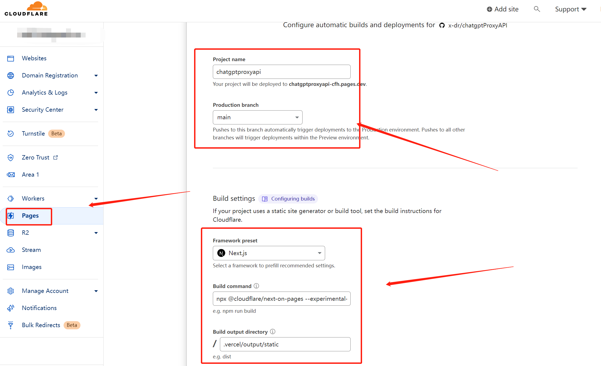
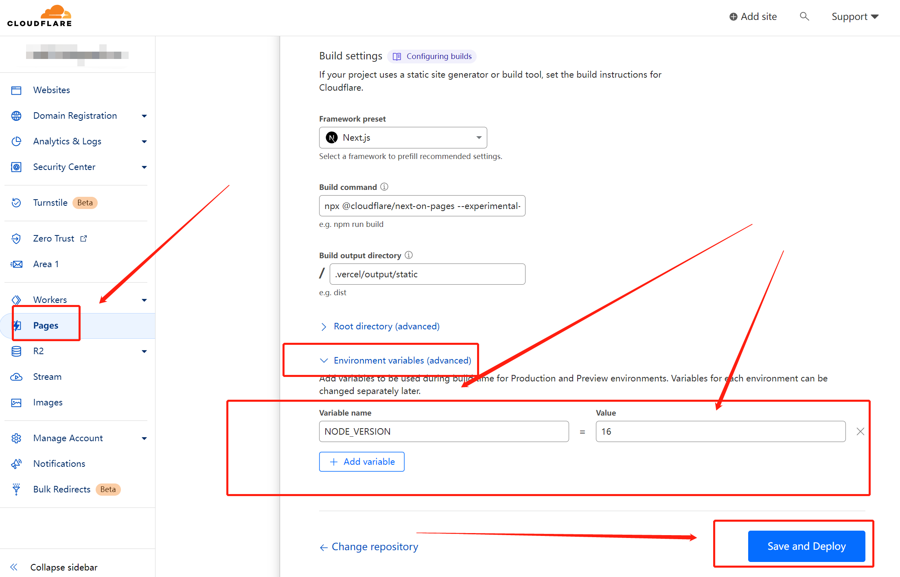
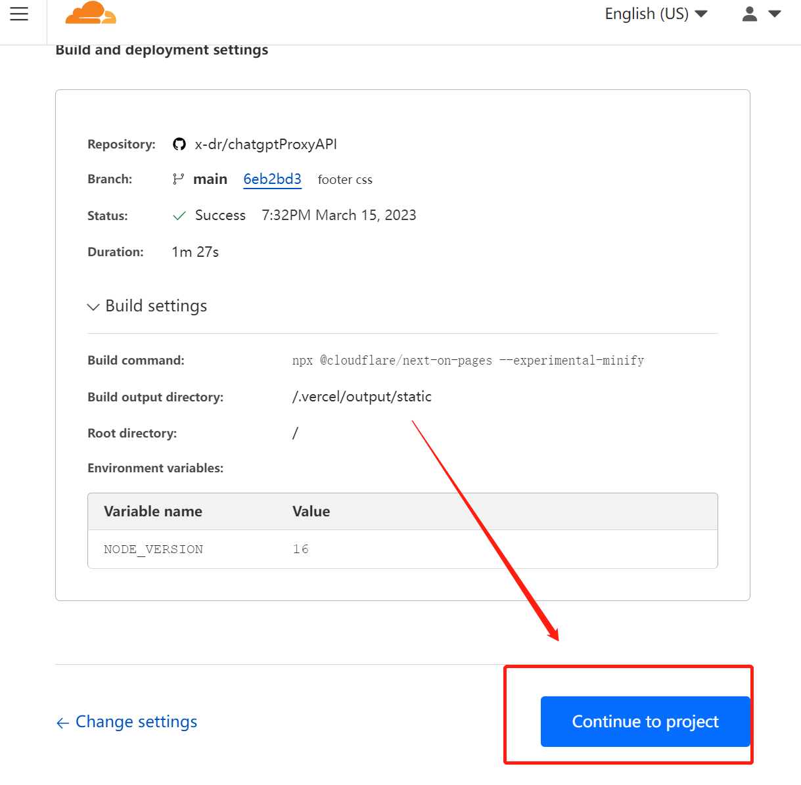

## 利用Cloudflare pages部署

1. ~~Fork本项目 [x-dr/chatgptProxyAPI](https://github.com/x-dr/chatgptProxyAPI/fork)~~ 点击[Use this template](https://github.com/x-dr/chatgptProxyAPI/generate)按钮创建一个新的代码库。
2. 登录到[Cloudflare](https://dash.cloudflare.com/)控制台.
3. 在帐户主页中，选择`pages`> ` Create a project` > `Connect to Git`


4. 选择你 Fork 的项目存储库，在`Set up builds and deployments`部分中，选择`Next.js`作为你的框架预设。


|  Configuration option	   | Value  |
|  ----  | ----  |
| Production branch  | main |
| Framework preset  | next.js |
| Build command	  | npx @cloudflare/next-on-pages --experimental-minify|
| Build directory  | .vercel/output/static|



> 在 `Environment variables (advanced)`添加一个参数

|  Variable name	   | Value  |
|  ----  | ----  |
| NODE_VERSION   | 16 |





5. 点击`Save and Deploy`部署



> 然后点`Continue to project`即可看到访问域名


**至此便大功告成。等待片刻，应该就可以通过你自己的域名来代替 OpenAI 的 API 地址了，比如在本文的例子中，想要请求 ChatGPT 的 API ，即是把官方 API 地址 https://api.openai.com/v1/chat/completions 换为我自己的域名 https://openai-proxy-api.pages.dev/api/v1/chat/completions ，其他参数均参照官方示例即可。由于 Cloudflare 有每天免费 10 万次的请求额度，所以轻度使用基本是零成本的。**

### 使用 

> 以我的搭建的服务`https://openai-proxy-api.pages.dev/` 为例

1. 对话

```bash
curl --location 'https://openai-proxy-api.pages.dev/api/v1/chat/completions' \
--header 'Authorization: Bearer sk-xxxxxxxxxxxxxxx' \
--header 'Content-Type: application/json' \
--data '{
   "model": "gpt-3.5-turbo",
  "messages": [{"role": "user", "content": "Hello!"}]
 }'

```

<details>

<summary>响应</summary>

```json
{
    "id": "chatcmpl-6rMlZybwjMQIhFAEaiCmWvMP1BXld",
    "object": "chat.completion",
    "created": 1678176917,
    "model": "gpt-3.5-turbo-0301",
    "usage": {
        "prompt_tokens": 9,
        "completion_tokens": 11,
        "total_tokens": 20
    },
    "choices": [
        {
            "message": {
                "role": "assistant",
                "content": "\n\nHello! How can I assist you today?"
            },
            "finish_reason": "stop",
            "index": 0
        }
    ]
}

```

</details>

2. 查询key余额

```bash
curl --location 'https://openai-proxy-api.pages.dev/api/dashboard/billing/credit_grants' \
--header 'Authorization: Bearer sk-xxxxxx'

```

<details>

<summary>响应</summary>

```json
{
    "object": "credit_summary",
    "total_granted": 18.0,
    "total_used": 9.543368000000001,
    "total_available": 8.456631999999999,
    "grants": {
        "object": "list",
        "data": [
            {
                "object": "credit_grant",
                "id": "xxxxxxx-xxxx-xxxx-xxxx-xxxxxxxxxx",
                "grant_amount": 18.0,
                "used_amount": 18,
                "effective_at": 1666666200.0,
                "expires_at": 1666666600.0
            }
        ]
    }
}
```

</details>
