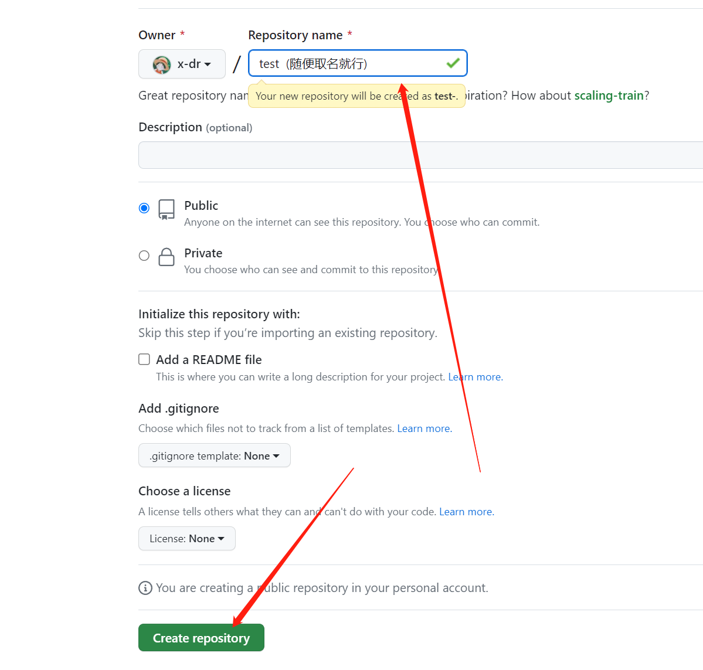
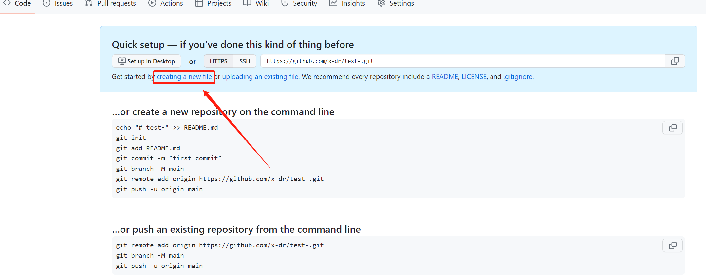
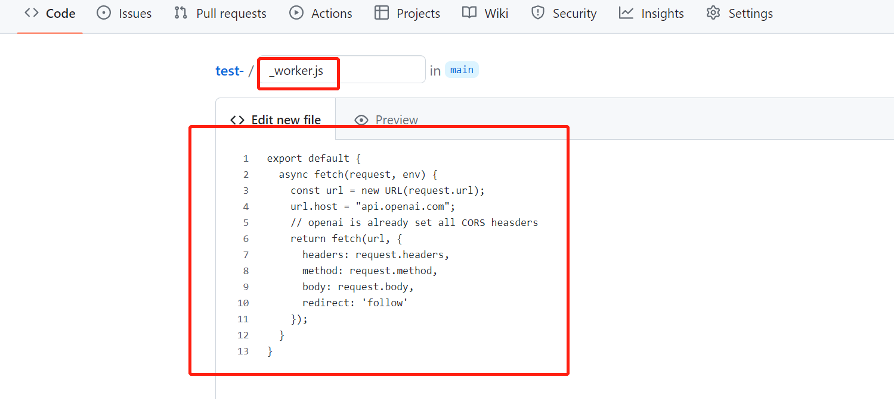
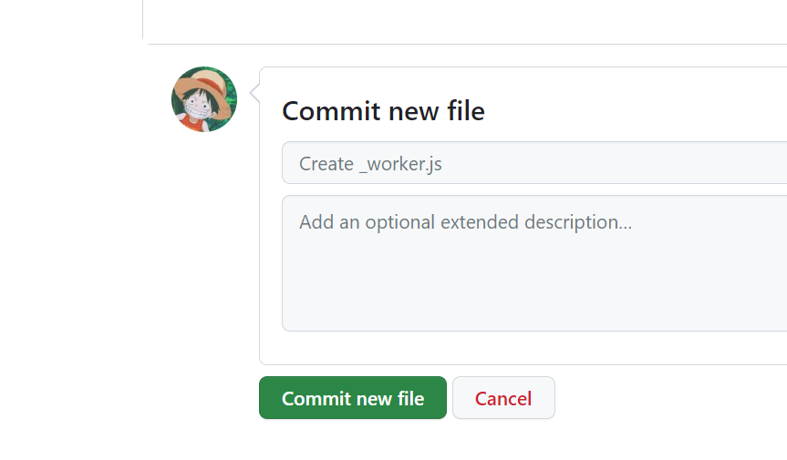

由于Workers的域名已经被污染了。在CloudFlare Workers自定义域名的方案之后，我来和大家一起在CloudFlare Pages利用其的Functions部署中转，作为一种备用方法。


### 打开Github，新建一个仓库





### 点击creating a new file按钮

1. 创建一个文件名为_worker.js的文件，然后复制以下代码

```js
export default {
  async fetch(request, env) {
    const url = new URL(request.url);
    url.host = "api.openai.com";
    // openai is already set all CORS heasders 
    return fetch(url, {
      headers: request.headers,
      method: request.method,
      body: request.body,
      redirect: 'follow'
    });
  }
}

```



2. 然后点`Commit new file`保存



#### 扩展

> 如果想中转别的网站把下面代码中的`TELEGRAPH_URL`换为别网站就行

<details>

<summary>代码</summary>

```js

const TELEGRAPH_URL = 'https://api.openai.com';


export default {
  async fetch(request, env) {
      const NewResponse = await handleRequest(request)
      return NewResponse
  },

};

async function handleRequest(request) {
  const url = new URL(request.url);
  const headers_Origin = request.headers.get("Access-Control-Allow-Origin") || "*"
  url.host = TELEGRAPH_URL.replace(/^https?:\/\//, '');
  const modifiedRequest = new Request(url.toString(), {
    headers: request.headers,
    method: request.method,
    body: request.body,
    redirect: 'follow'
  });
  const response = await fetch(modifiedRequest);
  const modifiedResponse = new Response(response.body, response);
  // 添加允许跨域访问的响应头
  modifiedResponse.headers.set('Access-Control-Allow-Origin', headers_Origin);
  return modifiedResponse;
}

```
</details>

### 部署

1. 登录到[Cloudflare](https://dash.cloudflare.com/)控制台.
2. 在帐户主页中，选择`pages`> ` Create a project` > `Connect to Git`


3. 选择你 Fork 的项目存储库，在`Set up builds and deployments`部分中，选择None作为您的框架预设。其他为空。(即保持默认即可)

4. 点击`Save and Deploy`部署


> 然后点`Continue to project`即可看到访问域名


### 用法 

**[参考](https://github.com/x-dr/chatgptProxyAPI#用法)**
