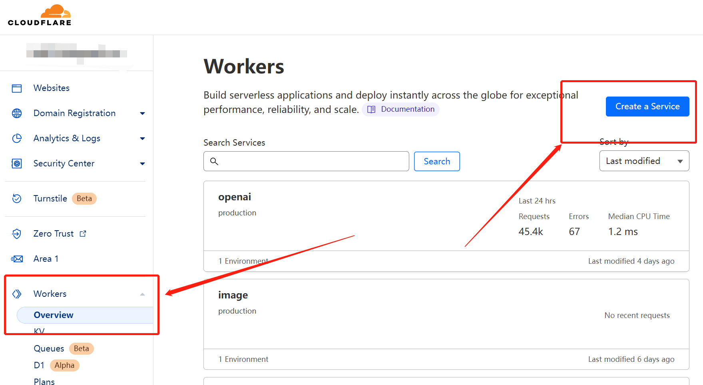
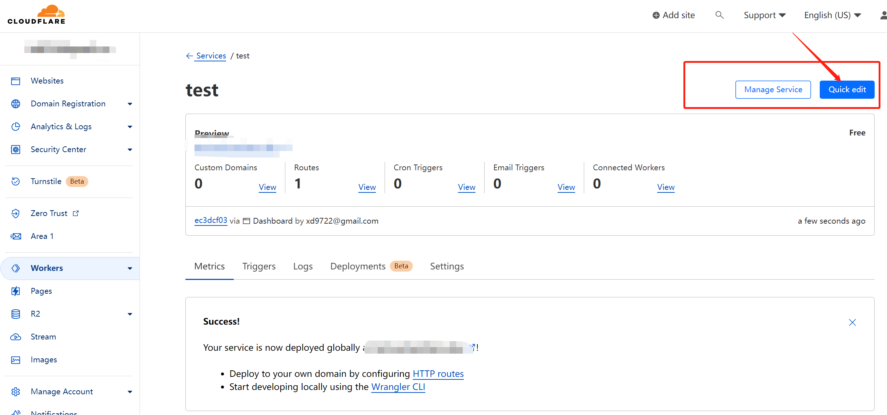
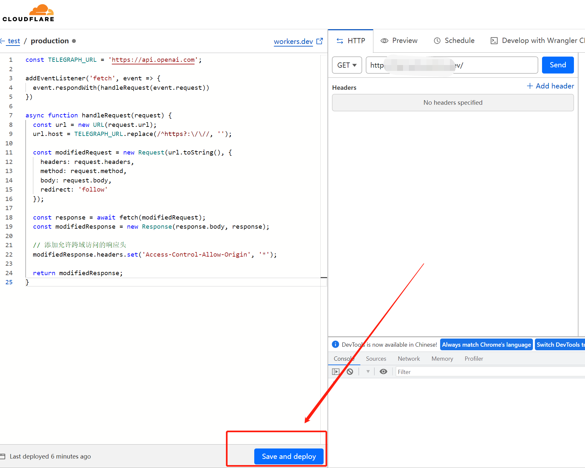
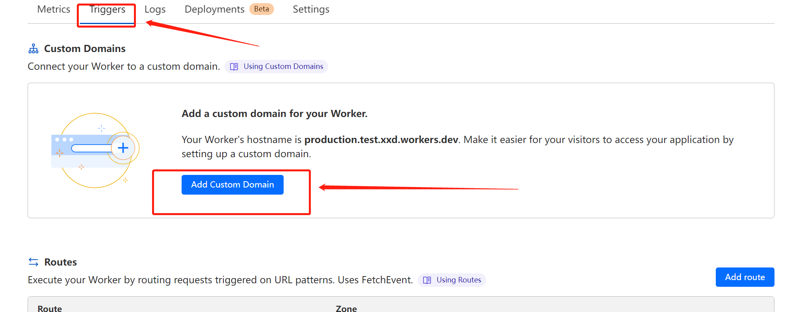
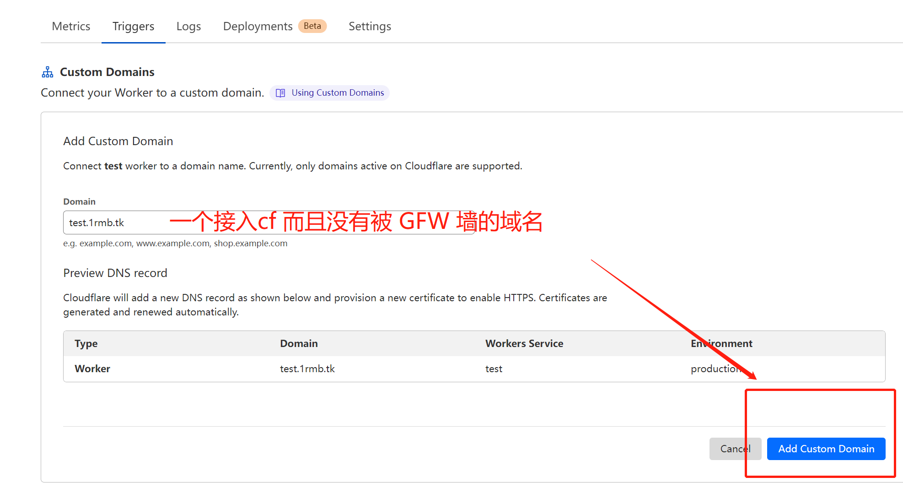

## 利用Cloudflare Worker中转api.openai.com


由于 Cloudflare Worker的域名`workers.dev`被墙境内要绑定自己的域名才能访问，但`CloudFlare Pages`的域名还是可以访问，所以我们可以用CloudFlare Pages的Functions部署中转 **[部署方法](./cloudflare_proxy_pages.md)**


**本文以下内容来自[noobnooc/discussions/9](https://github.com/noobnooc/noobnooc/discussions/9)有修改**

1. 新建一个 Cloudflare Worker
2. 复制 [cf_worker.js](https://cdn.jsdelivr.net/gh/x-dr/chatgptProxyAPI@main/cf_worker.js)  里的代码粘贴到 Worker 中并部署
3. 给 Worker 绑定一个没有被 GFW 墙的域名
4. 使用自己的域名代替 api.openai.com

### 具体操作

#### 创建一个 Cloudflare Worker

1. 登录到 Cloudflare 的管理界面后，点击侧边栏的 `Workers` 选项，然后点击 `Create a Service` 创建一个 Worker。



> 然后在创建界面中输入 `Service name` 后点击 `Create Service` 按钮新建 Worker。`Select a starter` 项不用管。


> 至此 Cloudflare 的 Worker 便创建好了，下面开始修改 Worker 的代码，使其能代理 OpenAI 的 API。

#### 修改 Cloudflare Worker 的代码

> 在 Worker 的管理界面，点击右上角的 “Quick Edit” 按钮编辑代码 Worker 的代码。



> 在左侧的代码编辑器中，删除现有的所有代码，然后复制粘贴以下内容到代码编辑器：

```js
const TELEGRAPH_URL = 'https://api.openai.com';

addEventListener('fetch', event => {
  event.respondWith(handleRequest(event.request))
})

async function handleRequest(request) {
  const url = new URL(request.url);
  const headers_Origin = request.headers.get("Access-Control-Allow-Origin") || "*"
  url.host = TELEGRAPH_URL.replace(/^https?:\/\//, '');
  const modifiedRequest = new Request(url.toString(), {
    headers: request.headers,
    method: request.method,
    body: request.body,
    redirect: 'follow'
  });
  const response = await fetch(modifiedRequest);
  const modifiedResponse = new Response(response.body, response);
  // 添加允许跨域访问的响应头
  modifiedResponse.headers.set('Access-Control-Allow-Origin', headers_Origin);
  return modifiedResponse;
}

```




> 最后点击编辑器右下角的 `Save and deploy` 按钮部署该代码，在弹出的对话框中继续选择 `Save and deploy` 确认部署。


**但是你可能会发现，这样做了依然还是没有解决问题，因为 Cloudflare Workers 的 workers.dev 域名也是被墙。但是好在只是墙了 workers.dev 域名，而 ip 还是幸存的状态，所以我们可以给 Worker 绑定一个自己的域名。**

#### 绑定域名

> 在 Cloudflare Workers 的管理界面中，点击 `Triggers` 选项卡，然后点击 `Custom Domians` 中的 `Add Custom Domain` 按钮以绑定域名。



> 输入域名后点击 `Add Custom Domain` (目前只支持 NS 托管在 Cloudflare 上的域名，如果不介意，可以点击 Cloudflare 侧边栏的 “Websites”，然后点击 “Add a Site” 按钮，根据提示将域名的 NS 记录指定到 Cloudflare。)




**至此便大功告成。等待片刻，应该就可以通过你自己的域名来代替 OpenAI 的 API 地址了，比如在本文的例子中，想要请求 ChatGPT 的 API ，即是把官方 API 地址 https://api.openai.com/v1/chat/completions 换为我自己的域名 https://openai.1rmb.tk/v1/chat/completions ，其他参数均参照官方示例即可。由于 Cloudflare 有每天免费 10 万次的请求额度，所以轻度使用基本是零成本的。**


## 使用 

1. 对话

```bash
curl --location 'https://openai.1rmb.tk/v1/chat/completions' \
--header 'Authorization: Bearer sk-xxxxxxxxxxxxxxx' \
--header 'Content-Type: application/json' \
--data '{
   "model": "gpt-3.5-turbo",
  "messages": [{"role": "user", "content": "Hello!"}]
 }'

```

<details>

<summary>响应</summary>

```json
{
    "id": "chatcmpl-6rMlZybwjMQIhFAEaiCmWvMP1BXld",
    "object": "chat.completion",
    "created": 1678176917,
    "model": "gpt-3.5-turbo-0301",
    "usage": {
        "prompt_tokens": 9,
        "completion_tokens": 11,
        "total_tokens": 20
    },
    "choices": [
        {
            "message": {
                "role": "assistant",
                "content": "\n\nHello! How can I assist you today?"
            },
            "finish_reason": "stop",
            "index": 0
        }
    ]
}

```

</details>

2. 查询key余额

```bash
curl --location 'https://openai.1rmb.tk/dashboard/billing/credit_grants' \
--header 'Authorization: Bearer sk-xxxxxx'

```

<details>

<summary>响应</summary>

```json
{
    "object": "credit_summary",
    "total_granted": 18.0,
    "total_used": 9.543368000000001,
    "total_available": 8.456631999999999,
    "grants": {
        "object": "list",
        "data": [
            {
                "object": "credit_grant",
                "id": "xxxxxxx-xxxx-xxxx-xxxx-xxxxxxxxxx",
                "grant_amount": 18.0,
                "used_amount": 18,
                "effective_at": 1666666200.0,
                "expires_at": 1666666600.0
            }
        ]
    }
}
```

</details>


### 查询 OPENAI API 余额

[https://checkbilling.1rmb.tk/](https://checkbilling.1rmb.tk/)
